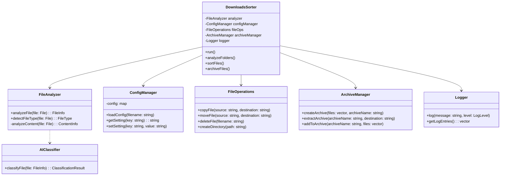

# downloads-sorter

```mermaid
classDiagram
    class DownloadsSorter {
        -FileAnalyzer analyzer
        -ConfigManager configManager
        -FileOperations fileOps
        -ArchiveManager archiveManager
        -Logger logger
        +run()
        +analyzeFolders()
        +sortFiles()
        +archiveFiles()
    }

    class FileAnalyzer {
        +analyzeFile(file: File): FileInfo
        +detectFileType(file: File): FileType
        -analyzeContent(file: File): ContentInfo
    }

    class ConfigManager {
        -config: map<string, string>
        +loadConfig(filename: string)
        +getSetting(key: string): string
        +setSetting(key: string, value: string)
    }

    class FileOperations {
        +copyFile(source: string, destination: string)
        +moveFile(source: string, destination: string)
        +deleteFile(filename: string)
        +createDirectory(path: string)
    }

    class ArchiveManager {
        +createArchive(files: vector<string>, archiveName: string)
        +extractArchive(archiveName: string, destination: string)
        +addToArchive(archiveName: string, files: vector<string>)
    }

    class Logger {
        +log(message: string, level: LogLevel)
        +getLogEntries(): vector<LogEntry>
    }

    class AIClassifier {
        +classifyFile(file: FileInfo): ClassificationResult
    }

    DownloadsSorter --> FileAnalyzer
    DownloadsSorter --> ConfigManager
    DownloadsSorter --> FileOperations
    DownloadsSorter --> ArchiveManager
    DownloadsSorter --> Logger
    FileAnalyzer ..> AIClassifier
```
